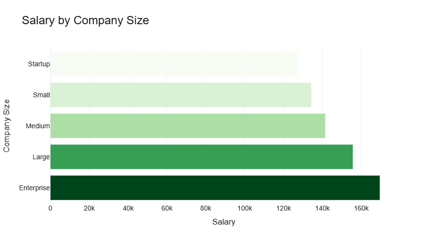
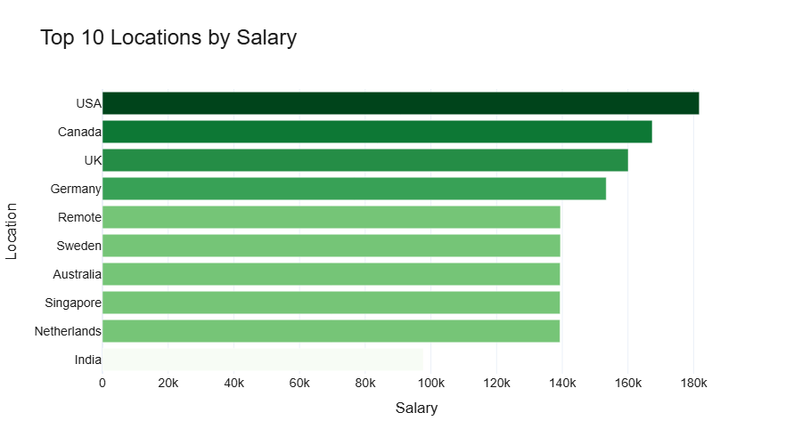
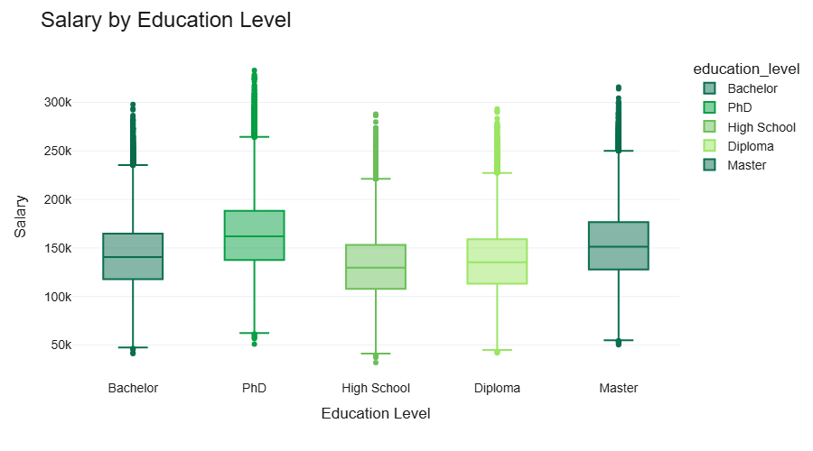
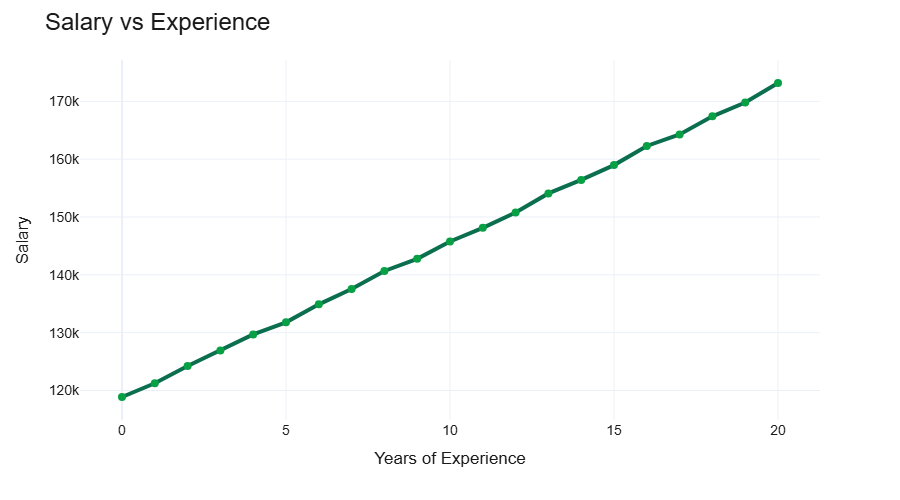
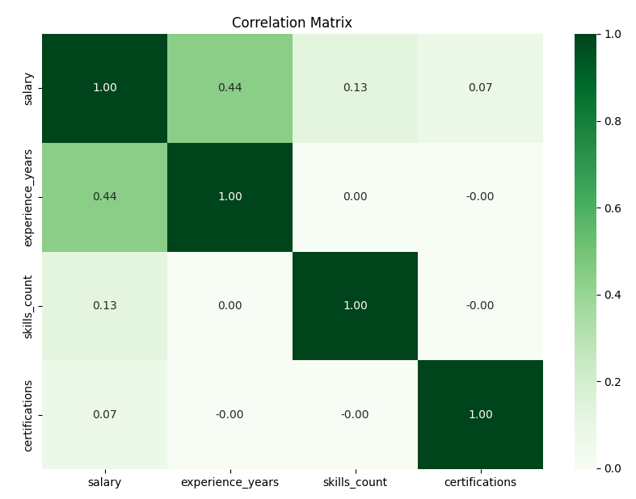
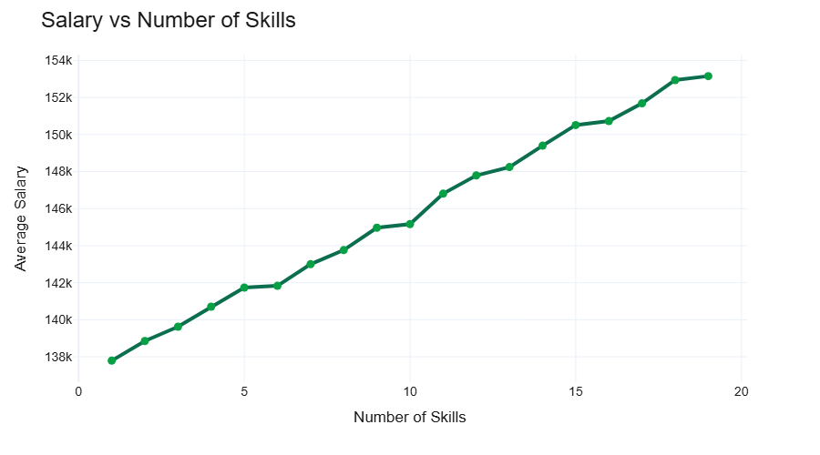
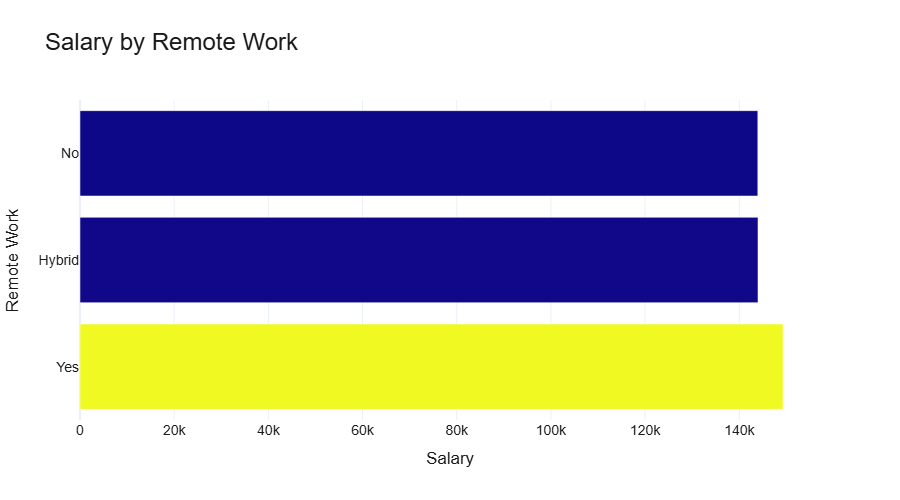
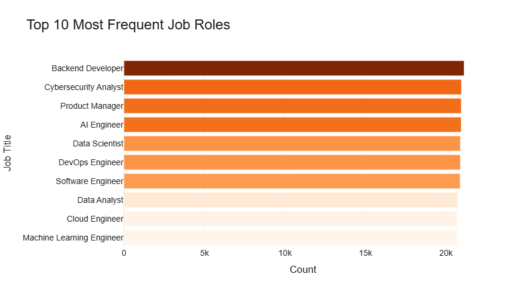
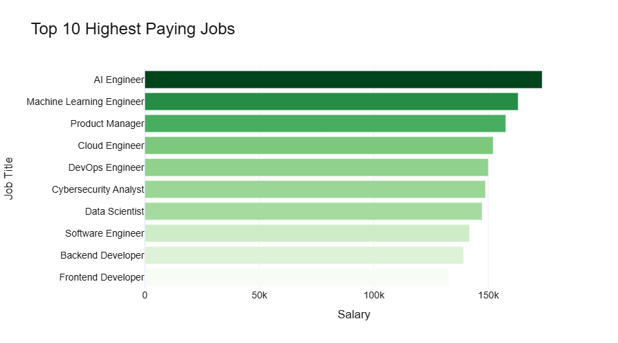

#  Salary Prediction & Data Analysis Project

##  Project Overview

This project aims to perform an Exploratory Data Analysis (EDA) and build Machine Learning models to predict salaries based on multiple features.

The dataset was obtained from Kaggle:  
https://www.kaggle.com/datasets/algozee/employee-salary-prediction-dataset

- **250,000 rows**
- **10 features**

 Dataset Description

##  Dataset Description

The dataset includes:

- **job_title** – Job role  
- **experience_years** – Years of experience  
- **education_level** – Education level  
- **skills_count** – Number of skills  
- **industry** – Industry  
- **company_size** – Company size  
- **location** – Country  
- **remote_work** – Work type (Remote/Hybrid/On-site)  
- **certifications** – Number of certifications  
- **salary** – Target variable  

---

 Data Exploration

##  Data Exploration

###  Data Quality

- No missing values  
- Clean and well-structured dataset  
- Balanced distribution across categories  

---

###  Summary Statistics

- Average salary: **145,718**
- Min salary: **31,867**
- Max salary: **333,046**
- Average experience: **10 years**

---

 Exploratory Data Analysis

##  Exploratory Data Analysis

###  Company Size vs Salary

## Company Size vs Salary

Company size is the most impactful factor in salary. The graph  shows that Enterprise companies pay **169,616** compared to Startups **127,289**, a difference of 42k. This may be due to market experience or investments in trained teams or materials; these factors require further analysis for precise confirmation. However, large companies pay more than small companies and startups.

- Enterprise: **169,616**
- Startup: **127,289**

-> **Most impactful variable**

---

###  Location Analysis

- Dataset is balanced across countries (~25k each)

### Salary by Location

## Salary vs Location

- USA: **181,716**
- Canada: **167,391**
- UK: **160,075**
- Germany: **153,377**
- ...
- Singapore: **139,341**
- India: **139,295**

##  Top 10 Most Frequent Locations

| Rank | Location     | Frequency |
|------|--------------|----------|
| 1    | Australia    | 25258    |
| 2    | Canada       | 25165    |
| 3    | Sweden       | 25100    |
| 4    | Remote       | 25065    |
| 5    | Singapore    | 25035    |
| 6    | USA          | 24931    |
| 7    | UK           | 24927    |
| 8    | India        | 24895    |
| 9    | Netherlands  | 24861    |
| 10   | Germany      | 24763    |

-> Difference > **40k**
-> **Strong impact**

The graph highlights that location is the most important factor impacting salary. It shows the 10 highest-paying locations, and it's noticeable that the most frequent location according to EDA (Australia) is not the highest-paying (USA). This can be deduced from the high investment in IT and the presence of giant companies that dominate the market.

---

###  Education vs Salary

## Education vs Salary

- PhD: **163,976**
- Master: **153,305**
- Bachelor: **142,410**
- High School: **131,715**

As can be seen in the boxplot graph, there is a high presence of outlines, but overall the average salary increases with the level of education. It is noted that PhD employees receive more than 269,000 reaching up to 333,000, with a similar variation for those with a Master's degree.

-> Higher education → higher salary  
-> Difference ~ **32k**

---
### Education Distribution Across Locations

Education levels are evenly distributed across all locations, with no significant differences between countries.

This indicates that salary variations across regions are not driven by differences in education levels, but are more likely influenced by economic conditions and market demand.

---

#### Key Insight

-> Salary differences are primarily driven by **market conditions**, not by education or certifications.

---

### Experience vs Salary

## Experience vs Salary

- 0 years: **118,872**
- +9 years: **142,763**

The line graph shows that the relationship between salary and experience is almost directly proportional, reaching a point where an increase of 5 years of experience adds 10,000 or 15,000 to the salary.

-> **Strong upward trend**  
-> Correlation: **0.44 (moderate)**

## Correlation Matrix

---

###  Skills

Regarding skills, a low correlation is observed, but high in comparison with certifications, with a value of **0.13**.

## Skills vs Salary

When we analyze the line graph of the relationship with salary, a somewhat linear relationship is noted, with a small but noteworthy impact.

- 1 skill: **137,788**
- +10 skills: **145,163**

 Slight increase (~7k)

---
### Remote Work

## Remote Work vs Salary

In the comparative analysis between remote and hybrid or in-person work, it is noted that people who work remotely earn more, on average. However, when compared to other variables, the impact is small, around 5,000.

- Remote: **149,279**
- Hybrid: **143,969**
- On-site: **143,932**

-> Slight impact (~5k)

---

###  Certifications

- 0: **141,492**
- 5: **149,607**

Certifications also show a near-linear relationship with salary, but the impact is small compared to other factors. In summary, a correlation matrix was performed with salary, experience, skills, and certifications; it is noted that certifications show a correlation of **0.07** (the lowest of all).

This reinforces the moderate (or strong in this case) relationship with experience.

-> Small impact  
-> Correlation: **0.07 (weak)**

---

### Certifications by Location

In order to complement the study, we analyzed the relationship between certifications and location to assess the impact of one on the other and whether this relationship influenced salary. At EDA, it is observed that certification does not show considerable variation; that is, regardless of where the employee resides, they may have more or fewer certifications.

**CERTIFICATION BY LOCATION**
Germany        2.503493
Netherlands    2.493906
India          2.488371
Canada         2.487145
Singapore      2.485920
Remote         2.485139
UK             2.476110
Australia      2.471771

- Range: **2.47 – 2.52**

-> Very small variation across countries

---

### Correlation Analysis

## Correlation Matrix

| Relationship | Correlation |
|-------------|------------|
| Salary vs Experience | **0.44** |
| Salary vs Skills | **0.13** |
| Salary vs Certifications | **0.07** |

Experience is the strongest numerical predictor

---

### Industry

No significant impact (~145k across all)

---

### Job Role Analysis: Most Common Roles

## Top Most Frequent Job Role 

The most frequent job titles are studied, and it is noted that the 10 most frequent (appearing more than 20,000 times) are: 

- Backend Developer  
- Cybersecurity Analyst  
- Product Manager 
- AI Engineer
- Data Scientist
... 
As described in the bar graph.

### Highest Paying Roles

## Top 10 Highest Pay Jobs 

Although the most frequent job titles are not necessarily the highest paying, the chart of the top 10 highest-paying jobs shows that the AI ​​Engineer position is the highest paid at **173,498**, followed by ML Engineer, Product Manager, Cloud Engineer, and DevOps Engineer (**149,959**). Notably, these figures are due to other factors beyond the scope of this analysis, such as company size, company type, location, etc. However, it is interesting to note that Backend Developer is the second highest-paid position.

-> Most frequent ≠ highest paid

This section is merely a curiosity for the reader, since the type of position obviously influences the salary, as has been shown, but more data is needed to establish it as one of the factors impacting salary due to its complexity.

---

### Skills & Education

- Skills average ≈ **10 for all education levels**
- Certifications average ≈ **2.5 for all**

No strong relationship between:
- Education ↔ Skills  
- Education ↔ Certifications  

---

 Machine Learning

## Machine Learning

According to the objective of this analysis, the data presents excellent qualities and relationships for creating a linear regression model. We begin with the regression model and then use the Random Forest model to confirm or suggest another model that better fits the data.

### Model 1: Linear Regression

- MAE: **5,436**
- R²: **0.963**

-> Excellent performance  
-> Low prediction error  

---

### Model 2: Random Forest

- MAE: **5,693**
- R²: **0.961**

---

##  Model Comparison

| Model | MAE | R² |
|------|-----|----|
| Linear Regression | **5,436** | **0.963** |
| Random Forest | 5,693 | 0.961 |

---

### 🔹 Key Insight

-> Linear Regression performed slightly better  

-> Indicates **strong linear relationships** in the dataset  

### Equation

salary = 146756.08 + (41971.55 * location_USA) + (27941.45 * location_Canada) + (21532.27 * education_level_PhD) + (20967.21 * location_UK) + (13988.38 * location_Germany) + (10829.82 * education_level_Master) + (5338.89 * remote_work_Yes) + (2698.57 * experience_years) + (1613.18 * certifications) + (857.19 * skills_count)

---

 Feafture Importance 

## Top 10 Most Important Features (Random Forest)

| Rank | Feature                     | Importance |
|------|----------------------------|-----------|
| 1    | experience_years           | 0.2003    |
| 2    | location_India             | 0.1818    |
| 3    | location_USA               | 0.0757    |
| 4    | company_size_Startup       | 0.0611    |
| 5    | education_level_PhD        | 0.0607    |
| 6    | company_size_Small         | 0.0508    |
| 7    | job_title_Data Analyst     | 0.0446    |
| 8    | company_size_Medium        | 0.0437    |
| 9    | job_title_Business Analyst | 0.0425    |
| 10   | location_Canada            | 0.0344    |

The model identified experience, location, and company size as the most important features for predicting salary.
This confirms the insights obtained during the exploratory data analysis.

---

 Final Conclusions 
 

## Final Conclusions

The analysis shows that salary is primarily driven by market-related factors (location and company size) rather than individual attributes such as skills or certifications.

1) Company size and location are the strongest factors influencing salary
2) Experience is a strong and consistent predictor
3) Education has a moderate impact on salary
4) Skills, certifications, and remote work have limited influence
5) Industry shows almost no impact on salary variation
6) The dataset is highly structured with low noise
7) Simpler models outperform complex ones due to strong linear relationships

